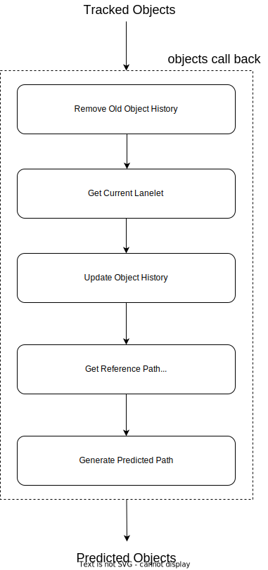

# map_based_prediction

## Purpose

`map_based_prediction` is a module to predict the future paths of other vehicles and pedestrians according to the shape of the map and the surrounding environment. It also calculates probability of the candidate paths.

## Assumptions

- 対象となる障害物(車や人)の以下の情報がわかっていること
  - カテゴリ(人や車などの種類)
  - 障害部の(重心)位置とその位置にいる時間
  - 物体の位置が map 座標(他の座標系情報しかないときは map 座標への変換式)
- 周辺環境について以下の情報がわかっていること
  - lanelet の地図情報

## Known Limits

- 障害物が乗用車、バス、トラックの時
  - 基本的に地図の形状に沿った予測経路を出力
  - 障害物の向きが lanelet の上にいてもその lanelet との向きの差が大きいときは地図情報は見ずに予測経路をだす(今回は直線経路)
  - 障害物がどの lanelet にもいないときは地図情報を見ずに予測経路を出す(今回は直線予測)
  - 引かれている経路がは車両のダイナミクスを無視したものを引く可能性がある
- 障害物が人やバイクの時
  - すべての状況において地図情報を見ずに予測経路を出す(今回は直線予測)
- すべての障害物に対して
  - 予測経路は T[s]だけ出てきてなおかつ dt[s]分の間隔で出てくる(つまり predicted path のサイズ N は N=T/dt)
  - T と dt はパラメータとしてユーザーが決められる
  - 障害物から加速度情報を取ってこれていないので縦方向は等速直線運動を仮定した予測になっている

## Inner-workings / Algorithms

### Flow Chart

1. Remove Old Object History

   現在の時刻(current_time)と Object History の中にある各 Object の時刻を比較して古いものは削除していく

2. Get Current lanelet

   障害物の現在の重心位置に対応する lanelet を一つまたは複数とってくる。なお、とってくる lanelet は以下の条件を満たしている必要がある。

   - 障害物の重心点が必ずその lanelet 内に入っていること
   - lanelet の中心線を構成する点が 2 つ以上あること
   - lanelet と車の向きの角度差がパラメータによって与えられる閾値内であること。ただし、detection で角度が 180 度反転している可能性もあるので、それは許す。(diff_yaw < threshold or diff_yaw > pi - threshold)
   - 過去の history で記録した lanelet の位置から到達可能な lanelet にいること

3. Update Object History

   現在いる lanelet を object history の中に入れる。なお、新しい障害物である場合は、新しく object history にその障害物を登録する。

4. Get Predicted Reference Path

   1. Get Reference Path

      該当 object がいる今の lanelet からこの object が沿う reference path を作る

   2. Predict Object Maneuver

      object の maneuver を予想する。現在の実装だと`Lane Follow`, `Left Lane Change`, `Right Lane Chagne`のそれぞれの maneuver に過去の history 情報と 1 で求めた reference path を用いて確率が振り分けられる。なお、maneuver の判定方法は以下の情報を用いて決める。

      - object の現在の重心位置とレーンの左右の境界線までの距離
      - t 秒前の横偏差と今の時刻の横偏差の変化率

      これらを用いたレーンチェンジ検出は以下の用になる

      Left Lane Change Detection

      if(d_current, left/d_lane > dl_ratio_threshold && (d_current, left - d_previous, left) > ddl_threshold)

      Right Lane Change Detection

      if(d_current, right/d_lane < dr_ratio_threshold && (d_current, right - d_previous, right) < ddr_threshold)

      なお、ハイパラメータは実験時に柏の葉で取ってきた実車データから解析して決めたものであり、一番誤判定が少なくなるようなパラメータとなっている。
      

   3. Calculate Object Probability

      2 で求めた objectn の maneuver 確率をさらに現在 object のいる位置や角度から再計算する。ここで現在の object の姿勢や位置を考慮した maneuver の確率を求めることができる。

5. Generate predicted trajectories

   4 でもとめた参照経路に対してジャーク最小となる予測経路を引く。なお、縦方向は 4 次のスプラインを使用し、横方向は 5 次のスプラインを使って経路を引く。

## Inputs / Outputs

### Input

| Name                                               | Type                                                 | Description                              |
| -------------------------------------------------- | ---------------------------------------------------- | ---------------------------------------- |
| `~/perception/object_recognition/tracking/objects` | `autoware_auto_perception_msgs::msg::TrackedObjects` | tracking objects without predicted path. |
| `~/vector_map`                                     | `autoware_auto_mapping_msgs::msg::HADMapBin`         | binary data of Lanelet2 Map.             |

### Output

| Name                     | Type                                                   | Description                           |
| ------------------------ | ------------------------------------------------------ | ------------------------------------- |
| `~/objects`              | `autoware_auto_perception_msgs::msg::PredictedObjects` | tracking objects with predicted path. |
| `~/objects_path_markers` | `visualization_msgs::msg::MarkerArray`                 | marker for visualization.             |

## Parameters

| Parameter                                   | Type   | Description                                                                                                  |
| ------------------------------------------- | ------ | ------------------------------------------------------------------------------------------------------------ |
| `enable_delay_compensation`                 | bool   | flag to enable the time delay compensation for the position of the object                                    |
| `prediction_time_horizon`                   | double | predict time duration for predicted path [s]                                                                 |
| `prediction_sampling_delta_time`            | double | sampling time for points in predicted path [s]                                                               |
| `min_velocity_for_map_based_prediction`     | double | apply map-based prediction to the objects with higher velocity than this value                               |
| `dist_threshold_for_searching_lanelet`      | double | The threshold of the angle used when searching for the lane to which the object belongs [rad]                |
| `delta_yaw_threshold_for_searching_lanelet` | double | The threshold of the distance used when searching for the lane to which the object belongs [m]               |
| `sigma_lateral_offset`                      | double | Standard deviation for lateral position of objects [m]                                                       |
| `sigma_yaw_angle`                           | double | Standard deviation yaw angle of objects [rad]                                                                |
| `object_buffer_time_length`                 | double | Time span of object history to store the information [s]                                                     |
| `history_time_length`                       | double | Time span of object information used for prediction [s]                                                      |
| `dist_ratio_threshold_to_left_bound`        | double | Conditions for using lane change detection of objects. Distance to the left bound of lanelet.                |
| `dist_ratio_threshold_to_right_bound`       | double | Conditions for using lane change detection of objects. Distance to the right bound of lanelet.               |
| `diff_dist_threshold_to_left_bound`         | double | Conditions for using lane change detection of objects. Differential value of horizontal position of objects. |
| `diff_dist_threshold_to_right_bound`        | double | Conditions for using lane change detection of objects. Differential value of horizontal position of objects. |

## Reference

1. M. Werling, J. Ziegler, S. Kammel, and S. Thrun, “Optimal trajectory generation for dynamic street scenario in a frenet frame,” IEEE International Conference on Robotics and Automation, Anchorage, Alaska, USA, May 2010.
2. A. Houenou, P. Bonnifait, V. Cherfaoui, and Wen Yao, “Vehicle trajectory prediction based on motion model and maneuver recognition,” in 2013 IEEE/RSJ International Conference on Intelligent Robots and Systems. IEEE, nov 2013, pp. 4363–4369.
